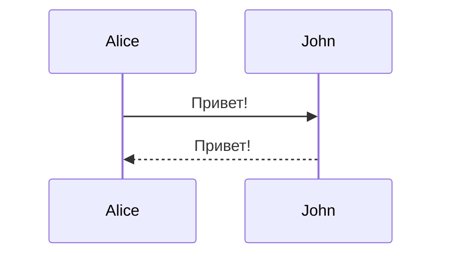

# Полная шпаргалка по Markdown

## Заголовки

```markdown
# Заголовок 1 уровня
## Заголовок 2 уровня
### Заголовок 3 уровня
#### Заголовок 4 уровня
##### Заголовок 5 уровня
###### Заголовок 6 уровня
```

Альтернативный синтаксис для заголовков 1 и 2 уровня:
```markdown
Заголовок 1 уровня
==================

Заголовок 2 уровня
------------------
```

## Форматирование текста

### Базовое форматирование
```markdown
**Жирный текст** или __жирный текст__
*Курсив* или _курсив_
***Жирный курсив*** или ___жирный курсив___
~~Зачёркнутый текст~~
`Моноширинный текст (код)`
```

### Результат:
**Жирный текст**  
*Курсив*  
***Жирный курсив***  
~~Зачёркнутый текст~~  
`Моноширинный текст`

## Списки

### Маркированные (неупорядоченные) списки
```markdown
- Элемент 1
- Элемент 2
  - Вложенный элемент 2.1
  - Вложенный элемент 2.2
- Элемент 3

* Альтернатива с *
+ Альтернатива с +
```

### Нумерованные (упорядоченные) списки
```markdown
1. Первый элемент
2. Второй элемент
3. Третий элемент
   1. Вложенный элемент 3.1
   2. Вложенный элемент 3.2
4. Четвёртый элемент
```

### Списки задач (чекбоксы)
```markdown
- [x] Выполненная задача
- [ ] Невыполненная задача
- [ ] Ещё одна задача
```

Результат:
- [x] Выполненная задача
- [ ] Невыполненная задача
- [ ] Ещё одна задача

## Ссылки

### Обычные ссылки
```markdown
[Текст ссылки](https://example.com)
[Ссылка с подсказкой](https://example.com "Подсказка при наведении")
```

### Автоматические ссылки
```markdown
<https://example.com>
<email@example.com>
```

### Ссылки с якорями
```markdown
[Текст ссылки](#заголовок)
```

### Ссылки-сноски
```markdown
Текст со [ссылкой][1].

[1]: https://example.com "Опциональное описание"
```

### Относительные ссылки
```markdown
[Файл в той же директории](./file.md)
[Файл в поддиректории](./subfolder/file.md)
[Файл на уровень выше](../file.md)
```

## Изображения

### Базовый синтаксис
```markdown


```

### Изображения со ссылками
```markdown
[](https://example.com)
```

### Изображения-сноски
```markdown
![Alt текст][logo]

[logo]: image.png "Описание"
```

### HTML для изображений с размерами
```markdown

```

## Цитаты

```markdown
> Это цитата.
> Она может занимать несколько строк.

> Вложенная цитата:
>> Второй уровень
>>> Третий уровень
```

Результат:
> Это цитата.
> Она может занимать несколько строк.

## Код

### Встроенный код
```markdown
Используйте `код` внутри текста.
```

### Блоки кода

Без подсветки синтаксиса:
````markdown
```
def hello():
    print("Hello World")
```
````

С подсветкой синтаксиса:
````markdown
```python
def hello():
    print("Hello World")
```
````

Языки для подсветки: `python`, `javascript`, `java`, `c`, `cpp`, `csharp`, `php`, `ruby`, `go`, `rust`, `sql`, `bash`, `json`, `xml`, `html`, `css`, `markdown`, и др.

### Блоки кода с отступами
```markdown
    def hello():
        print("Hello")
```

## Горизонтальные линии

```markdown
---

***

___

- - -
```

Все варианты дают:

---

## Таблицы

### Базовые таблицы
```markdown
| Заголовок 1 | Заголовок 2 | Заголовок 3 |
|-------------|-------------|-------------|
| Ячейка 1    | Ячейка 2    | Ячейка 3    |
| Ячейка 4    | Ячейка 5    | Ячейка 6    |
```

### Выравнивание в таблицах
```markdown
| Слева       | По центру   | Справа      |
|:------------|:-----------:|------------:|
| Текст       | Текст       | Текст       |
| Ещё текст   | Ещё текст   | Ещё текст   |
```

Результат:
| Слева       | По центру   | Справа      |
|:------------|:-----------:|------------:|
| Текст       | Текст       | Текст       |
| Ещё текст   | Ещё текст   | Ещё текст   |

### Форматирование в таблицах
```markdown
| Название    | Описание              |
|-------------|-----------------------|
| **Жирный**  | `Код`                 |
| *Курсив*    | [Ссылка](https://...) |
```

## Экранирование символов

Используйте обратный слэш `\` для экранирования специальных символов:
```markdown
\* Звёздочка (не станет маркером списка)
\# Решётка (не станет заголовком)
\[ Квадратная скобка
\] Квадратная скобка
\( Круглая скобка
\) Круглая скобка
\\ Обратный слэш
\` Обратный апостроф
\_ Подчёркивание
```

## HTML в Markdown

Markdown поддерживает встроенный HTML:
```markdown
<div align="center">
  <h1>Заголовок по центру</h1>
</div>

<details>
<summary>Раскрывающийся блок</summary>
Содержимое, которое можно скрыть/показать.
</details>

<kbd>Ctrl</kbd> + <kbd>C</kbd>

<mark>Выделенный текст</mark>

<sup>Надстрочный текст</sup>
<sub>Подстрочный текст</sub>

<br> <!-- Принудительный перенос строки -->
```

## Комментарии

```markdown
<!-- Это комментарий, он не будет виден в результате -->

[//]: # (Альтернативный способ комментария)
[comment]: <> (Ещё один вариант комментария)
```

## Якори и ссылки на разделы

```markdown
## Заголовок с якорем {#custom-id}

[Ссылка на раздел](#заголовок-с-якорем)
[Ссылка по ID](#custom-id)
```

Для создания якоря из заголовка:
- Убираются знаки препинания
- Пробелы заменяются на дефисы
- Всё переводится в нижний регистр

Пример:
```markdown
## Мой Заголовок! Пример?

Ссылка: [Перейти](#мой-заголовок-пример)
```

## Footnotes (Сноски)

```markdown
Текст со сноской[^1].

Ещё одна сноска[^note].

[^1]: Текст первой сноски.
[^note]: Текст именованной сноски.
```

## Эмодзи

### Код эмодзи
```markdown
:smile: :heart: :thumbsup: :rocket: :fire: :star:
:+1: :-1: :warning: :bulb: :pencil: :book:
```

Результат (если поддерживается):
:smile: :heart: :thumbsup: :rocket: :fire: :star:

### Unicode эмодзи
```markdown
😀 ❤️ 👍 🚀 🔥 ⭐
```

## Математические формулы (LaTeX)

Для поддержки в GitHub, GitLab, Jupyter и других:

### Встроенные формулы
```markdown
Формула $E = mc^2$ внутри текста.
```

### Блочные формулы
```markdown
$$
\int_{a}^{b} f(x) dx = F(b) - F(a)
$$
```

Или:
```markdown
```math
\sum_{i=1}^{n} i = \frac{n(n+1)}{2}
```
```

## Определения (Definition Lists)

```markdown
Термин
: Определение термина

Другой термин
: Первое определение
: Второе определение
```

## Аббревиатуры

```markdown
HTML
*[HTML]: HyperText Markup Language
```

## Подсветка текста

```markdown
==Выделенный текст==
```

## Диаграммы Mermaid

````markdown

````

````markdown

````

## GitHub-специфичные расширения

### Упоминания пользователей
```markdown
@username
```

### Ссылки на issues и PR
```markdown
#123
user/repo#123
```

### Автолинки коммитов
```markdown
16c999e8c71134401a78d4d46435517b2271d6ac
user/repo@16c999e
```

### Diff подсветка в блоках кода
````markdown
```diff
- удалённая строка
+ добавленная строка
  обычная строка
```
````

## Badges (Значки)

```markdown


```

## Переносы строк

### Жёсткий перенос
```markdown
Первая строка  
Вторая строка (два пробела в конце предыдущей)
```

### Или с использованием HTML
```markdown
Первая строка<br>
Вторая строка
```

## Кнопки (HTML)

```markdown
<a href="https://example.com">
  <button>Нажми меня</button>
</a>
```

Или:
```markdown
[](https://example.com)
```

## Цветной текст (HTML)

```markdown
<span style="color:red">Красный текст</span>
<span style="color:blue">Синий текст</span>
```

## Раскрывающиеся секции (Spoilers)

```markdown
<details>
<summary>Нажмите для раскрытия</summary>

Скрытое содержимое здесь.

- Можно использовать
- Любой markdown
- Внутри

</details>
```

## YouTube видео

```markdown
[](https://www.youtube.com/watch?v=VIDEO_ID)
```

## Центрирование

```markdown
<p align="center">
  
</p>

<div align="center">
  Центрированный текст
</div>
```

## Полезные комбинации

### Цитата с кодом
```markdown
> ```python
> def hello():
>     print("Hello")
> ```
```

### Таблица с кодом
```markdown
| Функция     | Описание                |
|-------------|-------------------------|
| `print()`   | Вывод в консоль         |
| `input()`   | Ввод с клавиатуры       |
```

### Список с кодом
```markdown
- Первый элемент
  ```python
  code_here = True
  ```
- Второй элемент
```

## Быстрая шпаргалка

```markdown
**жирный**          *курсив*           ~~зачёркнутый~~
`код`               [ссылка](url)      
> цитата            ---                1. список
- список            - [ ] задача       # заголовок
```

## Советы и лучшие практики

1. **Пустые строки**: Оставляйте пустую строку между блоками для лучшей читаемости
2. **Заголовки**: Используйте только один H1 в документе
3. **Списки**: Используйте `-` для маркированных списков (единообразие)
4. **Таблицы**: Выравнивайте столбцы для лучшей читаемости исходника
5. **Ссылки**: Используйте относительные пути для внутренних ссылок
6. **Изображения**: Всегда указывайте alt-текст
7. **Код**: Всегда указывайте язык для подсветки синтаксиса

## Проверка Markdown

Онлайн редакторы для проверки:
- Dillinger.io
- StackEdit
- Markdown Live Preview
- GitHub/GitLab встроенный preview

---

**Документация и ресурсы**:
- CommonMark: https://commonmark.org/
- GitHub Flavored Markdown: https://github.github.com/gfm/
- Markdown Guide: https://www.markdownguide.org/

**Примечание**: Некоторые возможности могут не поддерживаться всеми парсерами Markdown. Проверяйте совместимость для вашей платформы (GitHub, GitLab, Jupyter, Hugo, Jekyll и т.д.).